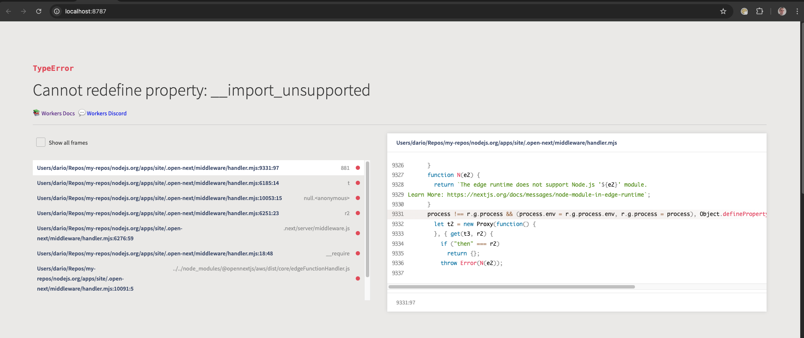

# open-next-15-middleware-experimental-repro

This is a simple reproduction that shows that the current `@opennextjs/cloudflare` doesn't support Next.js 15 with a middleware.

The build succeeds but at runtime an `__import_unsupported` error is thrown:

## Reproduction steps

To reproduce the issue:

- run `npm i`
- run `npm run preview`
- navigate to the app's local url to see the error
